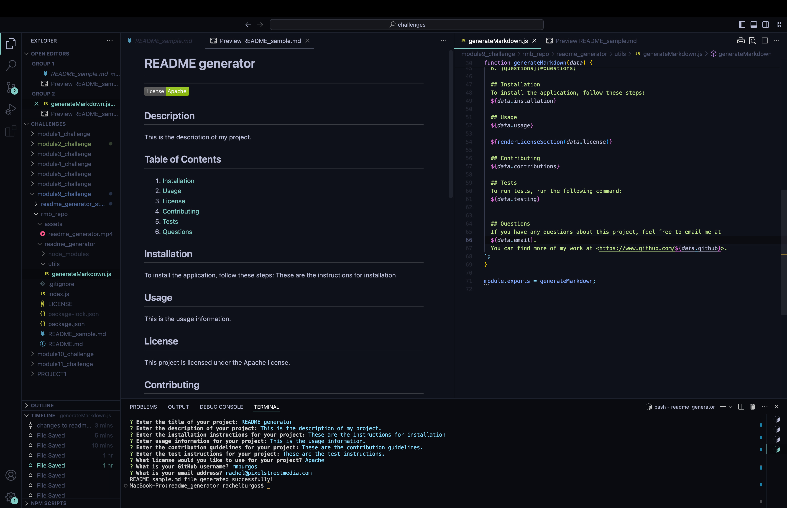

# Module 9 Challenge:  README GENERATOR

  ## Description
  - This project is a command-line application that helps developers quickly create professional and comprehensive README.md files for their projects. By answering a series of prompts, users can generate a well-structured README that includes all necessary sections and information.
 
 ## Tasks Completed

 -- Cloned starter code and pushed into a new repository in personal github account

 --  Using inquirer syntax, defined an array of questions which are prompted to the user to gather information needed to generate the README file on-the-fly.

 -- created function to write content to a specified file.  In this case the generated file is named README_sample.md so the project's README.md file is not overwritten each time the project is run.

 -- Completed the following functions renderLicenseBadge, renderLicenseLink, renderLicense section.  These functions return license data based on user input.  which returns the license link based on user input, function renderLicenseSection

  ## Installation
  - clone the repo
  - install npm using ``npm i`` in terminal
  - install necessary dependency, inquirer by typing ``npm i inquirer@8.2.4`` in terminal
  - run application using ``node index.js``

  ## Usage

https://github.com/user-attachments/assets/f3f9c421-85fe-4bd9-80e0-d78b903ec1d3

  ## Credits

\*\*This project was accomplished with the help provided by the instructors and TAs of the Rice University Coding Bootcamp, including Instructor Darian Mendez, Mateo Wallace, Mark Alfano, Gerard Mennella

Starter code was used to begin this project, which can be found at:
- <https://github.com/coding-boot-camp/potential-enigma>

References:
- <https://gist.github.com/kofiav/c1059e1075b67582e86b07aa9759e20d>

  ## License
- LicenseDistributed under the MIT License. See LICENSE.txt for more information.

